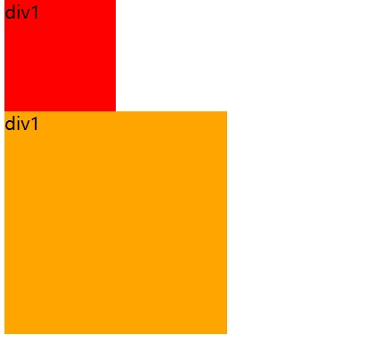

### css的引入方式


**内部样式表：**


    css代码写在style标签里面


**外部样式表** ：开发使用(最常用的)


    1. css代码写在单独的css文件中
    2.在html使用link标签引入
    <link rel="stylesheet" href="./my.css">
**行内样式：**
配合javascript使用


    css写在标签的style属性里
`<div style="color:red;font-size:20px;">这是div标签</div>`


### 选择器

作用：查找标签，设置样式.

**基础选择器**  

* 标签选择器  
使用标签名作为选择器 ，选中同名标签设置相同的样式  
例如:  p ,h1 div , a, img.....  
`<style>
    p {
        color:red;  
    }
</style>`

* 类选择器  
作用：查找标签，差异化设置标签的显示效果  
步骤：  
1.定义类选择器 ->类名  
2.使用类选择器 ->标签添加 class="类名"  
```<style>
    /* 定义类选择器 */
    .red {
        color:red;
    }
</style>

<!-- 使用类选择器 -->
 <div class="red">这是div标签</div>
 ```  
 注意： 


 1.类名自定义，不要用纯数字或中文，尽量用英文命名  
 2.一个类选择器可以供多个标签使用  
 3.一个标签可以使用多个类名，类名之间用空格隔开 
 
   
开发习惯：类名见名知意，可以用多个单词用 - 连接，；例如：new-hd


* id选择器  
作用：查找标签，差异化设置标签的显示效果  
场景：id选择器一般配合js使用，很少用来设置css样式  
步骤：  
1.定义id选择器 -> #id名  
2.使用id选择器 -> 标签添加id = "id名"  
规则：  
同一个id选择器在一个页面只能使用一次

* 通配符选择器  
作用：查找页面的所有标签，设置相同样式。  
通配符选择器： * ，不需要调用，浏览器自动查找页面所有标签，设置相同样式  
`* {  
    color:red;  
}`  
### 画盒子
目标：使用合适的选择器画盒子  
新属性：  
| 属性名 | 作用 |
|---- | -----|
|width |宽度 |
|height|高度|
|backgrond-color|背景色|   





### css样式
|描述|属性|
|----|----|
|字体大小|font-size|
|字体粗细|font-weight|
|行高|line-height|
|字体倾斜|font-style|
|字体族|font-family|
|字体复合属性|font|
|文本缩进|text-indent|
|文本对齐|text-align|
|修饰线|text-decoration|
|颜色|color|


* 字体样式（是否倾斜）  
作用：清除文字默认的倾斜效果  
属性值：  
1.正常（不倾斜）：normal  
   2.倾斜：italic  
* 行高  
作用：设置多行文本的间距  
属性值：  
数字 + px  
数字（当前标签font-size属性值的倍数）  
`
line-height:30px;
/* 当前标签字体大小为16px */
line-height:2;
`  
* 行高-垂直居中  
垂直居中技巧：行高属性值等于盒子高度属性值  
* font 属性必须按照 是否倾斜 是否加粗 字号/行高 字体，字号和字体值必须书写，否则不生效
* 文本缩进  
属性值  
1.数字+px  
2.数字+em（推荐，1em = 当前标签的字号大小）  
* 文本对齐方式  
属性值：  
1.left:左对齐  
2.center：居中对齐
3.right：右对齐  
给图片水平居中给所在的父级设置居中对齐即可  
* 文本修饰线  
属性值：  
1.none：无  
2.underline：下划线  
3.line-through：删除线  
4.overline：上划线
### 复合选择器
定义：由两个或多个基础选择器，通过不同的方式组合而成  
作用：更准确、更高效的选择目标元素（标签）  
**后代选择器**  
后代选择器：选择某元素的后代元素  
选择器写法：父选择器 子选择器{css属性}，父子选择器之间用空格隔开  
`<style>
        div span {
            color: red;
        }
    </style>`  
    ` <div>
        div标签
        <br>
        <span>span标签</span>
        <p>
            <span>这是孙子span</span>
        </p>
    </div>`  
**子代选择器**  
子代选择器：选中某元素的子代元素（最近的子级）  
选择器写法：父选择器 > 子选择器{css属性},夫子选择器之间用 > 隔开  
`<style>
        div > p {
            color:red;
        }
    </style>`  
`<div>
        <span>这是div的儿子</span>
        <p>
            <span>这是div的孙子</span>
        </p>
    </div>`  
**并集选择器**  
并集选择器：选中多组标签设置相同的样式  
选择器写法：选择器1，选择器2，...,选择器N{css属性}，选择器之间用 ，隔开  
 `<style>
        div,
        p,
        span {
            color: red;
        }
    </style>`  
**交集选择器**  
交集选择器：选中同时满足多个元素的元素  
选择器写法：选择器1选择器2{css属性}，选择器之间连写，没有任何符号。  
`<style>
        p.box {
            color: red;
        }
</style>`  
 `<p class="box">p标签，使用了类选择器</p>
    <div class="box">div标签，使用了类选择器</div>`  
**伪类选择器**  
伪类选择器：伪类表示元素状态，选中元素的某个状态设置样式。  
鼠标悬停状态：选择器:hover{css属性}  
写法：  
1.类名：hover{css属性}  
2.使用类选择器.box:hover{css属性}  
`a:hover {
            color: red;
        }
        .box:hover {
            color: yellow;
        }`  
**伪类-超链接（拓展）**  
超链接一共四个状态  
选择器|作用|
|----|----|
|:link|访问前|
|:visited|访问后|
|:hover|鼠标悬停|
|:active|点击时(激活)|  

提示：如果要给超链接设置以上四个状态，需按照LVHA的顺序书写（表中从上而下的顺序）  
 `a:link {
            color: red;
        }
        a:visited {
            color: aliceblue;
        }
        a:hover {
            color: yellow;
        }
        a:active {
            color: black;
        }`  
### CSS特性
CSS特性：化简代码/定位问题，并解决问题  
* **继承性** 

继承性：子级默认继承父级的文字控制效果  
表中的都可以继承
|描述|属性|
|----|----|
|字体大小|font-size|
|字体粗细|font-weight|
|行高|font-height|
|字体倾斜|font-style|
|字体族|font-family|
|字体复合属性|font|
|文本缩进|text-indent|
|文本对齐|text-align|
|修饰线|text-decoration|
|颜色|color|

 `body {
            font-size: large;
            color: red;
            font-weight: 700;
        }`  

`<div>div标签</div>
    <p>p标签</p>
    <span>span标签</span>
    <br>
    <!-- 如果标签自己有样式则生效自己的样式，不继承 -->
    <a href="#">a标签</a>
    <h1>h1标签</h1>`

* **层叠性**  
特点：  
1.相同的属性会覆盖：后面的css属性覆盖前面的css属性  
2.不同的属性会叠加：不同的css属性都生效  
 ` div {
            color: red;
            font-size: large;
        }
        div {
            color: green;
            font-weight: 700;
        }`
* 优先级  
优先级：也叫权重，当一个标签使用了多种选择器，基于不同种类的选择器的匹配规则  
 ` div {
            color: red;
            font-size: large;
        }
        div {
            color: green;
            font-weight: 700;
        }`  

规则：选择器优先级高的样式生效  
公式：通配选择器<标签选择器<类选择器<id选择器<!important  
(选中标签的范围越大，优先级越低)  
**优先级-叠加计算规则**  
叠加计算：如果是复合选择器，则需要权重叠加计算  
公式：（每一级之间不存在进位）  
**（行内样式，id选择器的个数，类选择器个数，标签选择器个数）**  
1.从左向右依次比较选个数，同一级个数多的优先级高，如果个数相同，则向后比较  
2.！important权重最高  
3.继承性权重最低  
#### 背景属性
|描述|属性|
|----|----|
背景色|background-color
背景图|background-image
背景图平铺方式|background-repeat
背景图位置|background-position
背景图缩放|background-size
背景图固定|background-attachment
背景复合属性|background

* 背景图  
网页中，使用背景图实现装饰性的图片效果  
属性名：background-image (bgi)  
属性值：url（背景图URL）  
div {  
    width:400px;  
    height:400px;  

    background-image:url(./image/1.png)  
}   
背景图默认是平铺的效果  
* 背景图平铺方式  
属性名：bcakground-repeat (bgr)  

|属性值|效果|
|----|----|
no-repeat|不平铺
repeat|平铺（默认效果）
repeat-x|水平方向平铺
repeat-y|垂直方向平铺  

* 背景图位置  
属性名：background-position （bgp）  
属性值：水平方向位置 垂直方向位置

1.关键字  

|关键字|位置|
|----|----|
left|左侧
right|右侧
center|居中
top|顶部
bottom|底部

2.坐标 （数字+px,正负都可以）  
提示：  
1.关键字取值方式写法，可以颠倒取值顺序
2.可以只写一个关键字，另一个方向默认居中；数字只写一个值表示水平方向，垂直方向居中  
* 背景图缩放  
作用：设置背景图大小  
属性名：background-size (bgz)  
常用属性值：  
1. 关键字   
cover：等比例缩放背景图片以完全覆盖背景区，可能背景图片部分看不见  
contain：等比例缩放背景图片以完全装入背景区，可能背景区部分空白  
2. 百分比：根据盒子尺寸计算图片大小   
3. 数字+单位（例如px）  
* 背景图固定  
作用：背景不会随着元素的内容滚动  
属性名：background-attachment (bga)  
属性值：fixed  
`background-attachment:fixed;`  
* 背景复合属性  
属性名：background (bg)   
属性值:背景色 背景图 背景图平铺方式 背景图位置/背景图缩放 背景图固定 （空格隔开各个属性值，缩放背景图用/，不区分顺序）  
* 转换显示模式  
属性名：display  

|属性值|效果|
----|----
block|块级
inline-block|行内块